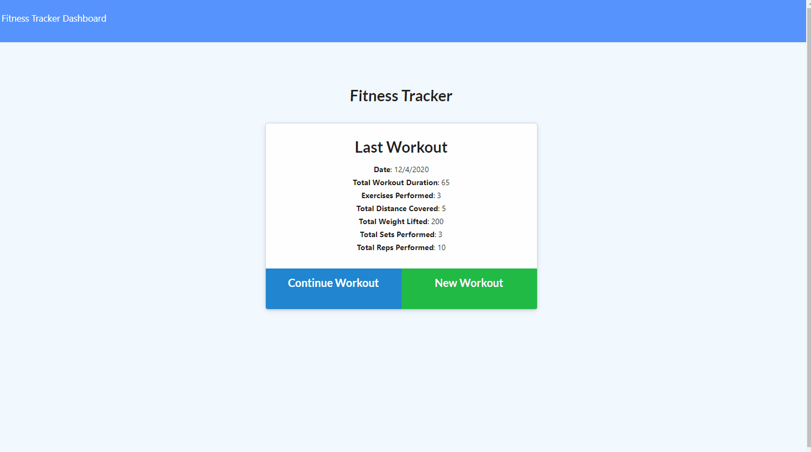

# Workout Tracker

## Description
    Web app to view, create and track daily workouts. Keep track of workout types like resistance and cardio as well as corresponding data about those exercises, like weight, sets, reps, duration, and distance. The app will also visualize your exercise stats.
    
## Table of Contents 
1. [Installation](#installation)
2. [Usage](#usage)
3. [Technologies](#technologies)
4. [Demo](#demo)
5. [License](#license)
6. [Contributing](#contributing)
7. [Tests](#tests)
8. [Questions](#questions)
    
## Installation
If you want to use this application you'll need to npm install the dependences and create+connect your own third party database service, such as MongoDB Atlas, and copy/past the db URI string into your environment variables configuration on your site deployment settings. 

## Usage
To use the app currently associated with this repo, visit the site at the following url: https://workout-tracker-20-v1.herokuapp.com/

## Technologies
HTML, CSS, Semantic UI, Express.js, MongoDB Atlas, Mongoose.

## Demo
    

## License 
  
Copyright (c) 2020 Rudi Kraeher
    
## Contributing
If you'd like to contribute please send me an email.
    
## Tests
I have no testing guidelines at this time.
    
## Questions
If you have any questions about the repo you can email me at rudikraeher@gmail.com.  
Visit my [GitHub](https://github.com/rkraeher) to see more of my work.